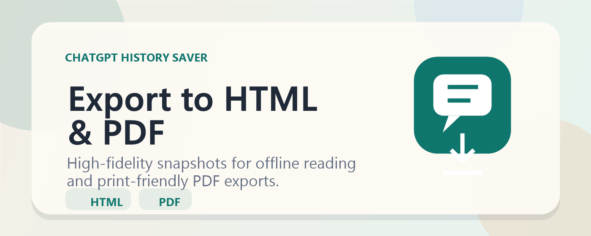
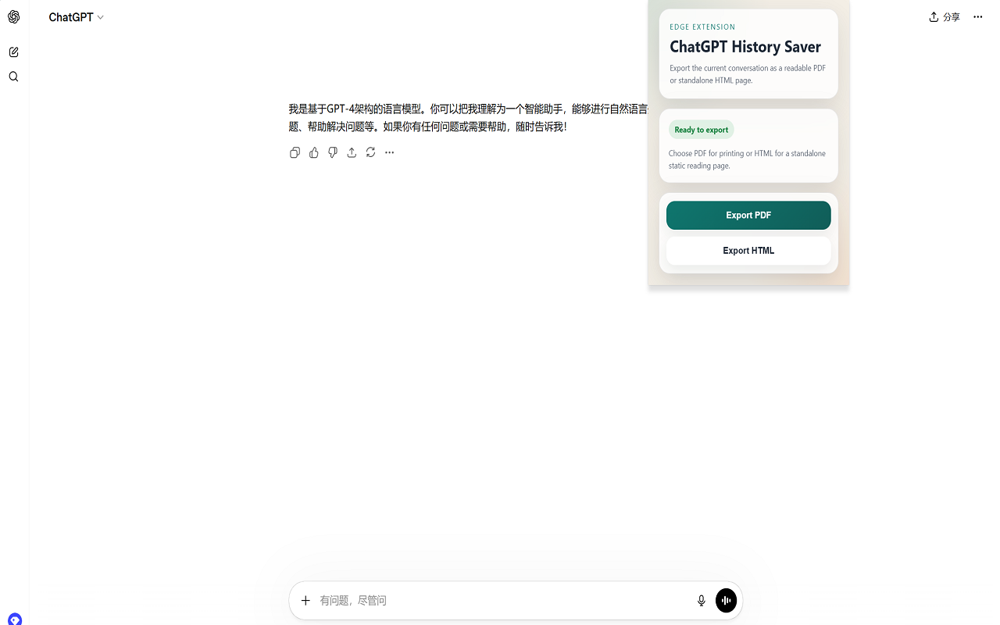
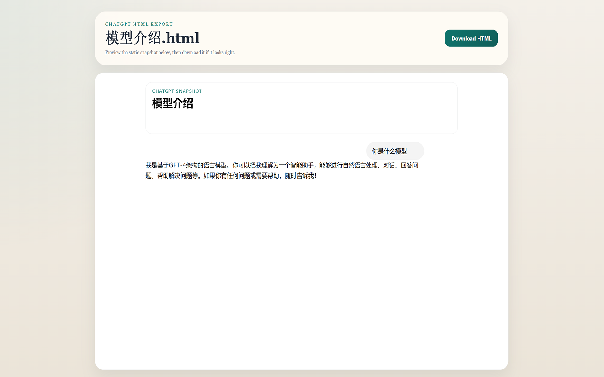
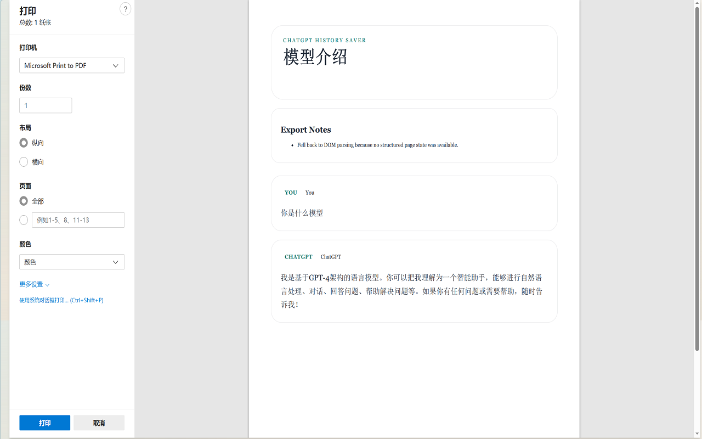

# ChatGPT History Saver



Export ChatGPT conversations to high-fidelity HTML snapshots and print-friendly PDFs.

ChatGPT History Saver is an Edge/Chromium extension built for people who want to save ChatGPT conversations in formats that still feel pleasant to read later. Instead of dumping raw text, it focuses on readable exports that are easy to archive, share, and revisit.

## Why people use it

- Save ChatGPT conversations as high-fidelity static HTML pages
- Create print-friendly PDF exports from the current conversation
- Keep code blocks, text layout, and images more readable than plain copy-paste
- Archive important chats for research, documentation, or personal knowledge bases

## How it looks


## Features

- One-click export from the browser action popup
- High-fidelity HTML export designed for offline reading
- PDF export through a dedicated print-friendly preview flow
- Best-effort image embedding for readable exports
- ChatGPT-only scope for `chatgpt.com` and `chat.openai.com`

## Screenshots

### Popup


### HTML Export


### PDF Export


## How it works

- `content/content.js` collects the current conversation or DOM snapshot from the active ChatGPT page.
- `background/background.js` coordinates export requests and opens the export flow.
- `export/export.html` renders the export preview page.
- HTML export focuses on a high-fidelity static snapshot workflow.
- PDF export opens a print-friendly preview page for browser-native PDF saving.

## Install locally in Edge

1. Open `edge://extensions/`
2. Enable `Developer mode`
3. Click `Load unpacked`
4. Select this project folder
5. Open a ChatGPT conversation page and test `Export HTML` or `Export PDF`

## Project structure

```text
background/   background service worker
content/      page collector and HTML snapshot logic
export/       preview pages and export UI
popup/        extension popup UI
shared/       shared serializers and helpers
icons/        extension icons
marketing/    promotional images for store/repo assets
docs/         store listing, privacy, release, and support docs
```

## Release and store materials

The repo already includes starter publishing materials:

- [Privacy policy](docs/PRIVACY_POLICY.md)
- [Store listing draft](docs/STORE_LISTING.md)
- [Release checklist](docs/RELEASE_CHECKLIST.md)
- [Contact safety guidance](docs/CONTACT_SAFETY.md)
- [GitHub launch checklist](docs/GITHUB_LAUNCH_CHECKLIST.md)

## Current limitations

- ChatGPT frontend changes may require parser updates
- Some protected or expiring images may not embed successfully
- Export fidelity depends on the visible page structure at export time

## Contributing

Contributions, bug reports, and improvement ideas are welcome.

- Read [CONTRIBUTING.md](CONTRIBUTING.md)
- Use the issue templates in `.github/ISSUE_TEMPLATE/`
- Keep changes focused and easy to review

## Security

If you discover a security issue, please read [SECURITY.md](SECURITY.md) before opening a public report.

## Changelog

See [CHANGELOG.md](CHANGELOG.md).
